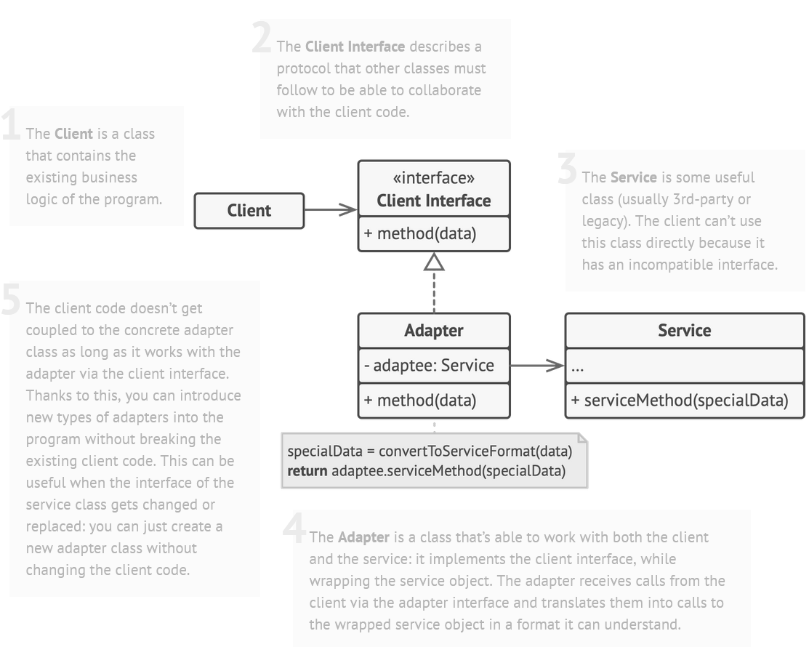
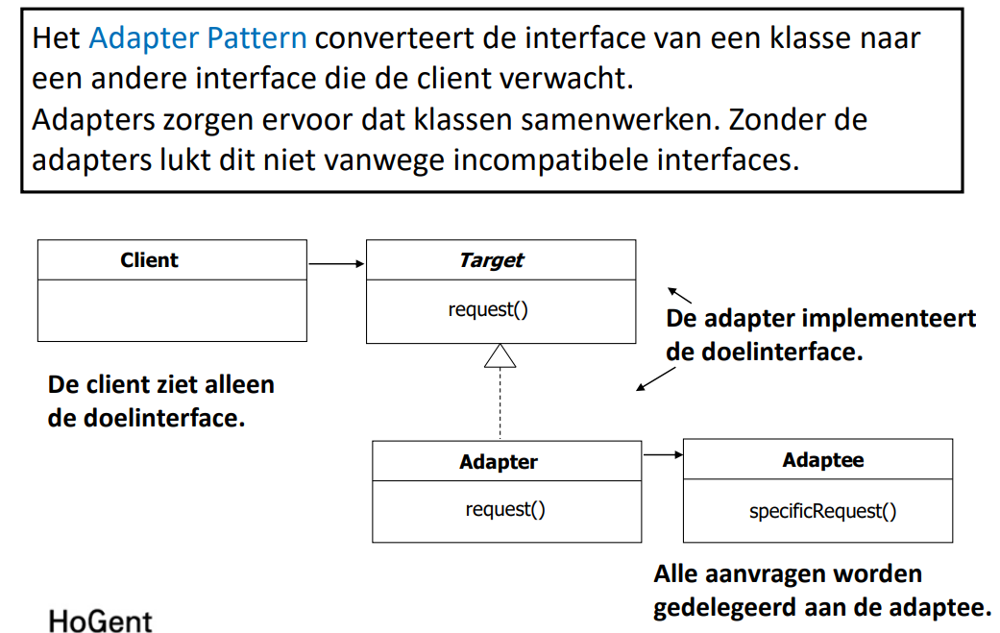

## [Adapter Design Pattern]()

### Probleem

Twee interfaces die niet met elkaar kunnen communiceren. Adapter zorgt ervoor dat ze wel met elkaar kunnen communiceren.

### Voorbeeld

Je hebt een eend die kan kwaken en vliegen. Je hebt een kalkoen die kan gobbelen en vliegen. Je hebt een kalkoen adapter
die een kalkoen kan laten doen alsof het een eend is.

### Oplossing

1. Maak een interface die de client verwacht
2. Maak een adapter die de interface implementeert
    - De addapter koppelt de methodes van de interface aan de methodes van de adaptee
3. Maak een adaptee die de interface niet implementeert




### Voorbeeld Vervolg

> stappen komen overeen met de stappen in de algemene oplossing

1. ```java
    public interface Duck {
         void quack();
         void fly();
    }
    ```
   ```java
   public class MallardDuck implements Duck {
            @Override
            public void quack() {
                System.out.println("Quack");
            }
        
            @Override
            public void fly() {
                System.out.println("I'm flying");
            }
        }
   ```
2. ```java
    public class TurkeyAdapter implements Duck {
        Turkey turkey;
    
        public TurkeyAdapter(Turkey turkey) {
            this.turkey = turkey;
        }
    
        @Override
        public void quack() {
            turkey.gobble();
        }
    
        @Override
        public void fly() {
            for (int i = 0; i < 5; i++) {
                turkey.fly();
            }
        }
    }
    ```
3. ```java
    public interface Turkey {
        void gobble();
        void fly();
    }
    ```
   ```java
   public class WildTurkey implements Turkey {
            @Override
            public void gobble() {
                System.out.println("Gobble gobble");
            }
        
            @Override
            public void fly() {
                System.out.println("I'm flying a short distance");
            }
        }
   ```


# [TERUG NAAR INHOUDSOPGAVE](../README.md)
