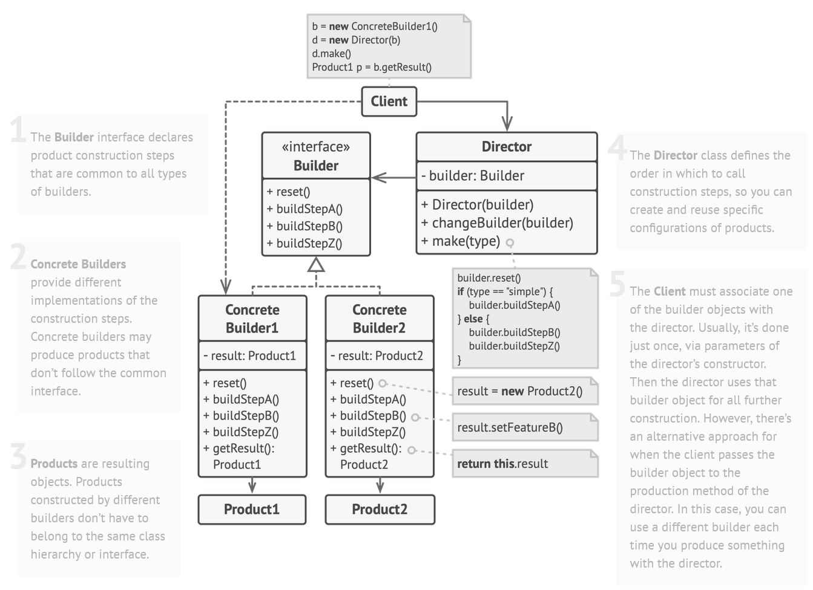

## [Builder Design Pattern](https://www.youtube.com/watch?v=MaY_MDdWkQw)

[Andere goeie video met beide methodes](https://www.youtube.com/watch?v=zAByFmRs6No)

### Probleem

Een object moet worden gemaakt met een complexe structuur.
Veel parameters moeten worden meegegeven aan de constructor.
We willen niet 10 verschillende constructors maken voor elk van de mogelijke gevallen.

-> When it's necessary to use a constructor with a long parameter list or when there's a long list of constructors with
different parameters. Thats when we use the builder pattern.

### Voorbeeld

Stel je wilt een huis bouwen. Niet iedereen zal hetzelfde huis willen bouwen. De ene wilt een zwembad de andere een
sauna, extra parking, ... ook de hoeveelheid ramen en deuren, keukens.
Dit doen met allemaal apart constructors is niet te doen voor elke mogelijke combinatie. Vandaar maken we gebruik van
het Builder Design Pattern.

### Oplossing - Algemeen zonder inner class

1. Maak een abstract class voor de Builder
   - Een method voor elk onderdeel van het product
   - Een method om het product te returnen
   - build() method om het product te maken
   - heeft product als property
2. Maak een class voor het product, deze bevat alle properties die nodig zijn om het product te maken + getters en
   setters
   - bv. Huis
      - Zwembad, badkamer, keuken, ...
3. Maak een class voor de concrete builder ze extends de abstract class van de builder.
4. Maak een class voor de director
   - Heeft constructor met de builder als parameter
   - Heeft een method die de builder aanroept om het product te maken
   - Heeft **getProduct** method om het product te returnen



### Voorbeeld Vervolg - Algemeen zonder inner class

> stappen komen overeen met de stappen in de algemene oplossing
>
> Voorbeeld toont nu gewoon 1 soort huis maar je zou verschillende concrete builders kunnen maken voor verschillende
> huizen met andere parameters

1. ```java
    abstract class Builder {
      
         private Huis huis;

         Huis getHuis();
   
         void setDoors();
         void setWindows();
         void setSwimmingPool();
         void setSauna();
         void setParking();
         void setBathroom();
         void setKitchen();
         void setBedroom();
   }
   ```
2. ```java
    public class Huis {
        private int aantalDeuren;
        private int aantalVensters;
        private boolean zwembad;
        private boolean sauna;
        private boolean parking;
        private boolean badkamer;
        private boolean keuken;
        private boolean slaapkamer;
   
           public Huis() {
            }
   
           public int getAantalDeuren() {
               return aantalDeuren;
           }
   
           public void setAantalDeuren(int aantalDeuren) {
               this.aantalDeuren = aantalDeuren;
           }
   
           public int getAantalVensters() {
               return aantalVensters;
           }
   
           public void setAantalVensters(int aantalVensters) {
               this.aantalVensters = aantalVensters;
           }
   
           public boolean isZwembad() {
               return zwembad;
           }
   
           public void setZwembad(boolean zwembad) {
               this.zwembad = zwembad;
           }
   
           public boolean isSauna() {
               return sauna;
           }
   
           public void setSauna(boolean sauna) {
               this.sauna = sauna;
           }
   
           public boolean isParking() {
               return parking;
           }
   
           public void setParking(boolean parking) {
               this.parking = parking;
           }
   
           public boolean isBadkamer() {
               return badkamer;
           }
   
           public void setBadkamer(boolean badkamer) {
               this.badkamer = badkamer;
           }
   
           public boolean isKeuken() {
               return keuken;
           }
   
           public void setKeuken(boolean keuken) {
               this.keuken = keuken;
           }
   
           public boolean isSlaapkamer() {
               return slaapkamer;
           }
   
           public void setSlaapkamer(boolean slaapkamer) {
               this.slaapkamer = slaapkamer;
           }
   
   }
    ```

3. ```java
    public class HuisBuilder extends Builder {
   
       private Huis huis;
   
       public HuisBuilder() {
           huis = new Huis();
       }
   
       @Override
       public Huis getHuis() {
           return huis;
       }
   
       @Override
       public void setDoors() {
           huis.setAantalDeuren(4);
       }
   
       @Override
       public void setWindows() {
           huis.setAantalVensters(4);
       }
   
       @Override
       public void setSwimmingPool() {
           huis.setZwembad(true);
       }
   
       @Override
       public void setSauna() {
           huis.setSauna(true);
       }
   
       @Override
       public void setParking() {
           huis.setParking(true);
       }
   
       @Override
       public void setBathroom() {
           huis.setBadkamer(true);
       }
   
       @Override
       public void setKitchen() {
           huis.setKeuken(true);
       }
   
       @Override
       public void setBedroom() {
           huis.setSlaapkamer(true);
       }
   }
   ```

4. ```java
    public class HuisDirector {
   
       private Builder builder;
   
       public HuisDirector(Builder builder) {
           this.builder = builder;
       }
   
       public Huis makeHuis() {
           builder.setDoors();
           builder.setWindows();
           builder.setSwimmingPool();
           builder.setSauna();
           builder.setParking();
           builder.setBathroom();
           builder.setKitchen();
           builder.setBedroom();
           return builder.getHuis();
       }
   }
   ```

### Oplossing - Algemeen met inner class

1. Maak een class voor het product, deze bevat alle properties die nodig zijn om het product te maken + getters en
   setters
    - bv. Huis
        - Zwembad, badkamer, keuken, ...
    - Maak een private constructor met builder als parameter
2. Maak een inner class voor de builder

### Voorbeeld Vervolg - Algemeen met inner class

```java
    public class Huis {
        private int aantalDeuren;
        private int aantalVensters;
        private boolean zwembad;
        private boolean sauna;
        private boolean parking;
        private boolean badkamer;
        private boolean keuken;
        private boolean slaapkamer;
   
           private Huis(HuisBuilder builder) {
               this.aantalDeuren = builder.aantalDeuren;
               this.aantalVensters = builder.aantalVensters;
               this.zwembad = builder.zwembad;
               this.sauna = builder.sauna;
               this.parking = builder.parking;
               this.badkamer = builder.badkamer;
               this.keuken = builder.keuken;
               this.slaapkamer = builder.slaapkamer;
           }
   
           public int getAantalDeuren() {
               return aantalDeuren;
           }
   
           public int getAantalVensters() {
               return aantalVensters;
           }
   
           public boolean isZwembad() {
               return zwembad;
           }
   
           public boolean isSauna() {
               return sauna;
           }
   
           public boolean isParking() {
               return parking;
           }
   
           public boolean isBadkamer() {
               return badkamer;
           }
   
           public boolean isKeuken() {
               return keuken;
           }
   
           public boolean isSlaapkamer() {
               return slaapkamer;
           }
  
   
           public static class HuisBuilder {
               private int aantalDeuren;
               private int aantalVensters;
               private boolean zwembad;
               private boolean sauna;
               private boolean parking;
               private boolean badkamer;
               private boolean keuken;
               private boolean slaapkamer;
   
               public HuisBuilder() {
               }
   
               public HuisBuilder setAantalDeuren(int aantalDeuren) {
                   this.aantalDeuren = aantalDeuren;
                   return this;
               }
   
               public HuisBuilder setAantalVensters(int aantalVensters) {
                   this.aantalVensters = aantalVensters;
                   return this;
               }
   
               public HuisBuilder setZwembad(boolean zwembad) {
                   this.zwembad = zwembad;
                   return this;
               }
   
               public HuisBuilder setSauna(boolean sauna) {
                   this.sauna = sauna;
                   return this;
               }
   
               public HuisBuilder setParking(boolean parking) {
                   this.parking = parking;
                   return this;
               }
   
               public HuisBuilder setBadkamer(boolean badkamer) {
                   this.badkamer = badkamer;
                   return this;
               }
   
               public HuisBuilder setKeuken(boolean keuken) {
                   this.keuken = keuken;
                   return this;
               }
   
               public HuisBuilder setSlaapkamer(boolean slaapkamer) {
                   this.slaapkamer = slaapkamer;
                   return this;
               }
   
               public Huis build() {
                   return new Huis(this);
               }
           }
         }
```

# [TERUG NAAR INHOUDSOPGAVE](../README.md)
