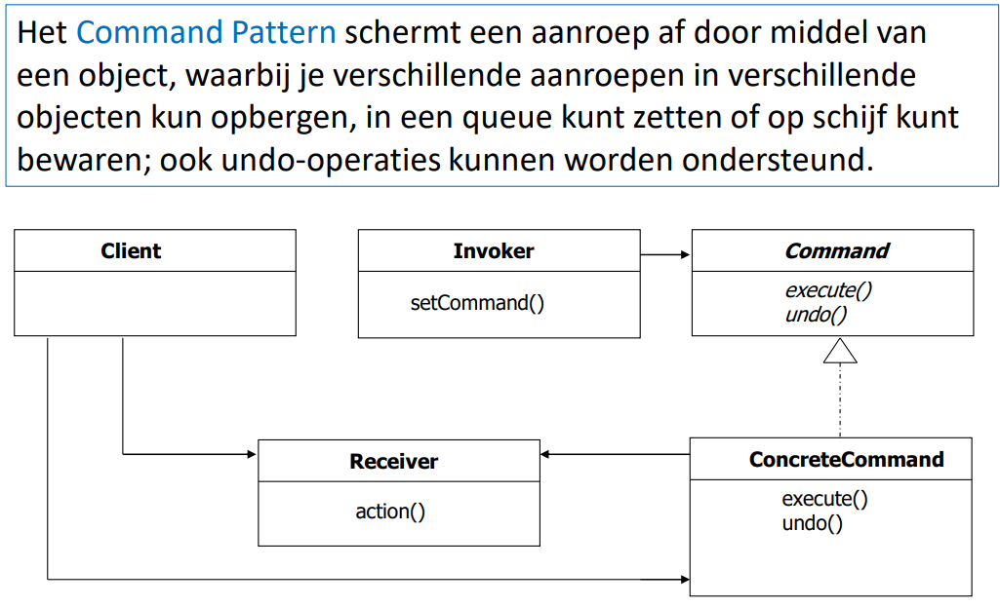
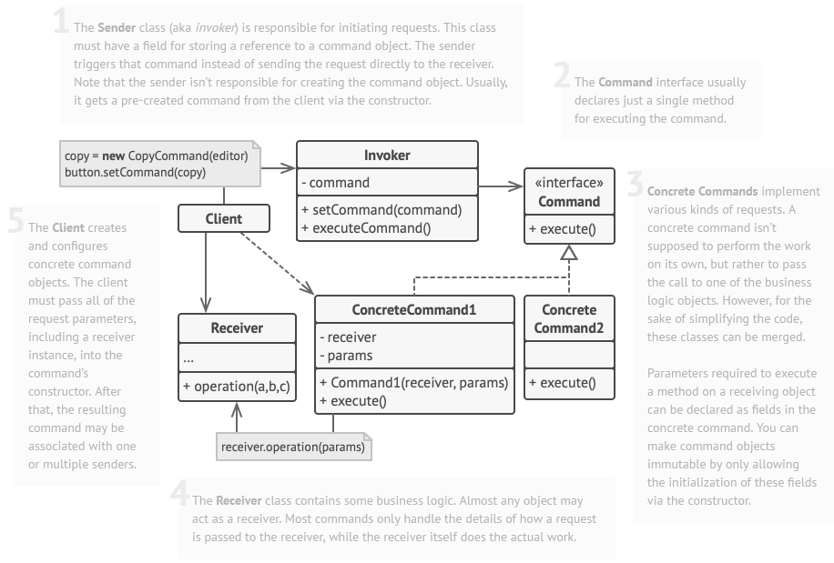

## [Command Design Pattern](https://www.youtube.com/watch?v=9qA5kw8dcSU)

### Probleem

Het Command Design Pattern lost het probleem op van het koppelen van de uitvoering van een actie aan de aanroepende
code. Dit kan leiden tot problemen zoals:

- Het creëren van overmatige afhankelijkheden tussen klassen, waardoor de code moeilijker te onderhouden en te testen
  is.
- Het ontbreken van flexibiliteit bij het toevoegen van nieuwe acties of het aanpassen van bestaande acties, omdat de
  aanroepende code moet worden gewijzigd om de veranderingen te ondersteunen.
- Het gebrek aan ondersteuning voor undo-functionaliteit, wat belangrijk kan zijn in bepaalde toepassingen.

Door gebruik te maken van het Command Design Pattern, kan de uitvoering van een actie worden gescheiden van de
aanroepende code, wat leidt tot een meer flexibele, modulaire en onderhoudbare code. Bovendien maakt het Command Design
Pattern het gemakkelijker om undo-functionaliteit toe te voegen aan een toepassing, waardoor de gebruiker de
mogelijkheid heeft om onbedoelde acties ongedaan te maken.

> ChatGPT ftw

### Voorbeeld

Stel je voor dat we een afstandsbediening hebben die verschillende apparaten kan bedienen, zoals een televisie, een
dvd-speler en een versterker. Elk apparaat heeft verschillende knoppen op de afstandsbediening waarmee verschillende
acties kunnen worden uitgevoerd, zoals het in- en uitschakelen van het apparaat, het veranderen van het kanaal, het
verhogen of verlagen van het volume, het afspelen van een dvd, enzovoort.

### Oplossing

1. Definieer een Command interface
    - execute() methode -> voert de actie uit
    - undo() methode -> maakt de actie ongedaan
2. Definieer receiver(s)
3. Definieer commando's voor elke actie
    - elk commando implementeert de Command interface
    - elk commando heeft een receiver
    - elk commando heeft een execute() methode die de actie uitvoert op de receiver
    - elk commando heeft een undo() methode die de actie ongedaan maakt op de receiver
4. Definieer een invoker
    - heeft een methode om een commando uit te voeren
    - heeft een methode om commando in te stellen
5. Koppel de invoker aan de commando's (client)

   
   

### Voorbeeld Vervolg

> stappen komen overeen met de stappen in de algemene oplossing

1. ```java
   public interface Command {
       void execute();
       void undo();
   }
   ```

2. ```java
   public class Light {
       public void on() {
           System.out.println("Light is on");
       }
   
       public void off() {
           System.out.println("Light is off");
       }
   }
   ```

3. ```java
    public class LightOnCommand implements Command {
         private Light light;
    
         public LightOnCommand(Light light) {
              this.light = light;
         }
    
         @Override
         public void execute() {
              light.on();
         }
    
         @Override
         public void undo() {
              light.off();
         }
    }
    
    public class LightOffCommand implements Command {
         private Light light;
    
         public LightOffCommand(Light light) {
              this.light = light;
         }
    
         @Override
         public void execute() {
              light.off();
         }
    
         @Override
         public void undo() {
              light.on();
         }
    }
   
    public class NoCommand implements Command {
         @Override
         public void execute() {
         }
    
         @Override
         public void undo() {
         }
    }
    ```

4. ```java
    public class RemoteControl {
        private Command[] onCommands;
        private Command[] offCommands;
    
        public RemoteControl(int numLights) {
            onCommands = new Command[numLights];
            offCommands = new Command[numLights];
    
            for (int i = 0; i < numLights; i++) {
                onCommands[i] = new NoCommand();
                offCommands[i] = new NoCommand();
            }
        }
    
        public void setCommand(int slot, Command onCommand, Command offCommand) {
            onCommands[slot] = onCommand;
            offCommands[slot] = offCommand;
        }
    
        public void pressOnButton(int slot) {
            onCommands[slot].execute();
        }
    
        public void pressOffButton(int slot) {
            offCommands[slot].execute();
        }
    }
    ```

5. ```java
    public static void main(String[] args) {
        Light light1 = new Light();
        Light light2 = new Light();
    
        RemoteControl remoteControl = new RemoteControl(2);
    
        Command light1OnCommand = new LightOnCommand(light1);
        Command light1OffCommand = new LightOffCommand(light1);
    
        Command light2OnCommand = new LightOnCommand(light2);
        Command light2OffCommand = new LightOffCommand(light2);
    
        remoteControl.setCommand(0, light1OnCommand, light1OffCommand);
        remoteControl.setCommand(1, light2OnCommand, light2OffCommand);
    
        remoteControl.pressOnButton(0);  // Turns on light 1
        remoteControl.pressOffButton(1); // Turns off light 2
    }
    ```

    ```
    Light 1 is turned on
    Light 2 is turned off
    ```

> je kan ook macro commando's maken, die een lijst van commando's uitvoeren

# [TERUG NAAR INHOUDSOPGAVE](../README.md)

PS: ChatGPT voorbeeldje mss beetje beter kdenk da het volledig is

```java
// Receiver class
public class Light {
    private int id;
    private boolean isOn;

    public Light(int id) {
        this.id = id;
        this.isOn = false;
    }

    public void turnOn() {
        this.isOn = true;
        System.out.println("Light " + id + " is turned on");
    }

    public void turnOff() {
        this.isOn = false;
        System.out.println("Light " + id + " is turned off");
    }

    public boolean isOn() {
        return isOn;
    }
}

// Command interface
public interface Command {
    void execute();
    void undo();
}

// Concrete command classes
public class TurnOnCommand implements Command {
    private Light light;

    public TurnOnCommand(Light light) {
        this.light = light;
    }

    public void execute() {
        light.turnOn();
    }

    public void undo() {
        light.turnOff();
    }
}

public class TurnOffCommand implements Command {
    private Light light;

    public TurnOffCommand(Light light) {
        this.light = light;
    }

    public void execute() {
        light.turnOff();
    }

    public void undo() {
        light.turnOn();
    }
}

public class MacroCommand implements Command {
    private Command[] commands;

    public MacroCommand(Command[] commands) {
        this.commands = commands;
    }

    public void execute() {
        for (Command command : commands) {
            command.execute();
        }
    }

    public void undo() {
        for (Command command : commands) {
            command.undo();
        }
    }
}

// Invoker class
public class RemoteControl {
    private Command[] onCommands;
    private Command[] offCommands;
    private Command undoCommand;

    public RemoteControl(int numLights) {
        onCommands = new Command[numLights];
        offCommands = new Command[numLights];

        Command noCommand = new NoCommand();
        for (int i = 0; i < numLights; i++) {
            onCommands[i] = noCommand;
            offCommands[i] = noCommand;
        }
        undoCommand = noCommand;
    }

    public void setCommand(int slot, Command onCommand, Command offCommand) {
        onCommands[slot] = onCommand;
        offCommands[slot] = offCommand;
    }

    public void pressOnButton(int slot) {
        onCommands[slot].execute();
        undoCommand = onCommands[slot];
    }

    public void pressOffButton(int slot) {
        offCommands[slot].execute();
        undoCommand = offCommands[slot];
    }

    public void pressUndoButton() {
        undoCommand.undo();
    }
}

// Client code
public class Client {
    public static void main(String[] args) {
        Light light1 = new Light(1);
        Light light2 = new Light(2);
        Light light3 = new Light(3);

        RemoteControl remoteControl = new RemoteControl(3);

        Command light1OnCommand = new TurnOnCommand(light1);
        Command light1OffCommand = new TurnOffCommand(light1);

        Command light2OnCommand = new TurnOnCommand(light2);
        Command light2OffCommand = new TurnOffCommand(light2);

        Command light3OnCommand = new TurnOnCommand(light3);
        Command light3OffCommand = new TurnOffCommand(light3);

        Command[] allLightsOnCommands = {light1OnCommand, light2OnCommand, light3OnCommand};
        Command allLightsOnMacroCommand = new MacroCommand(allLightsOnCommands);

        remoteControl.setCommand(0, allLightsOnMacroCommand, new UndoCommand(allLightsOnMacroCommand));
        remoteControl.setCommand(1, light1OnCommand, light1OffCommand);
        remoteControl.setCommand(2, light2OnCommand, light2OffCommand);
        remoteControl.setCommand(3, light3OnCommand, light3OffCommand);
        
        remoteControl.pressOnButton(0);  // Turns on all lights
        remoteControl.pressOffButton(1); // Turns off light 1
        remoteControl.pressUndoButton(); // Undo all lights on command
    }
```
