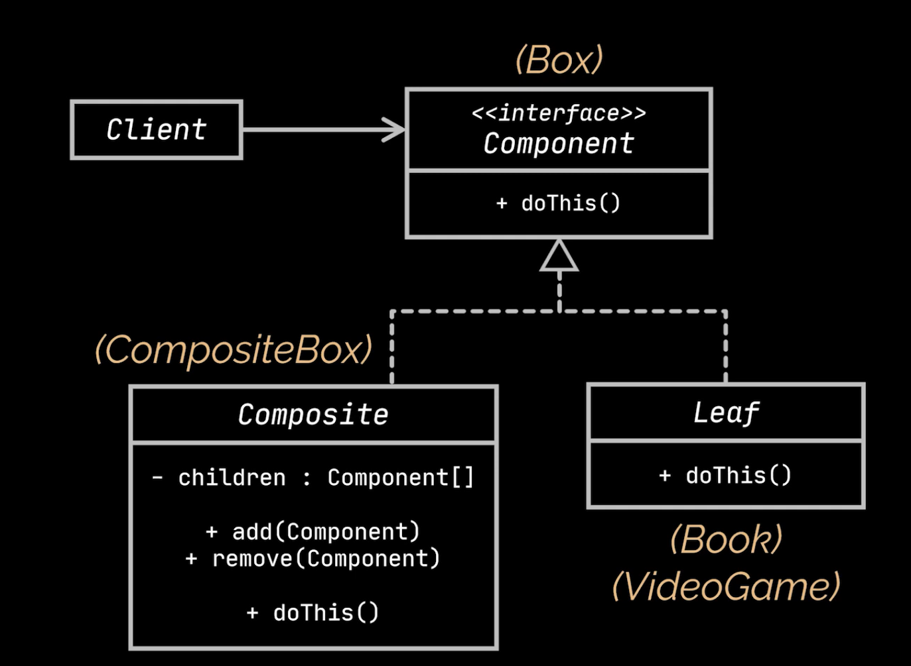

## [Composite Design Pattern](https://www.youtube.com/watch?v=2HUnoKyC9l0)

[Complexere video](https://www.youtube.com/watch?v=EWDmWbJ4wRA)

### Probleem

Een collectie van objecten moet als één object behandeld worden. Hierin kunnen nog collecties zitten maar ook de simpele
objecten. Het composite pattern zorgt ervoor dat je deze collecties en objecten op een uniforme manier kan behandelen.

### Voorbeeld

> 'An order might comprise various products, packaged in boxes, which are packaged in bigger boxes and so on. The whole
> structure looks like an upside down tree.'

Hieruit wil je dan bv de prijs berekenen

### Oplossing

1. Maak een interface voor de componenten
   - Deze interface bevat de methodes die de componenten moeten implementeren
2. Maak een Leaf klasse voor individuele componenten
   - Deze klasse implementeert de interface
3. Maak een Composite klasse voor groepen van componenten
   - Deze klasse implementeert de interface
   - Deze klasse bevat een lijst van componenten
   - Deze klasse bevat methodes om componenten toe te voegen en te verwijderen


### Voorbeeld Vervolg

> stappen komen overeen met de stappen in de algemene oplossing

1. ```java
   public interface Box {
         int getPrice();
   }
   ```
2. ```java
    public class Product implements Box {
            private int price;
    
            public Product(int price) {
                 this.price = price;
            }
    
            @Override
            public int getPrice() {
                 return price;
            }
    }
    ```
3. ```java
    public class BoxComposite implements Box {
            private List<Box> boxes = new ArrayList<>();
    
            public void addBox(Box box) {
                 boxes.add(box);
            }
    
            public void removeBox(Box box) {
                 boxes.remove(box);
            }
            //een product == een box en kan dus
            //op de zelfde manier de prijsberekening worden aangeroepe
            @Override
            public int getPrice() {
                 boxes.stream().mapToInt(Box::getPrice).sum();
            }
    }
    ```

   ```java
    public static void main(String[] args) {
            Box box = new BoxComposite();
            box.addBox(new Product(10));
            box.addBox(new Product(20));
            box.addBox(new Product(30));
            System.out.println(box.getPrice());
    }
    ```
   > OUTPUT: 60



# [TERUG NAAR INHOUDSOPGAVE](../README.md)
