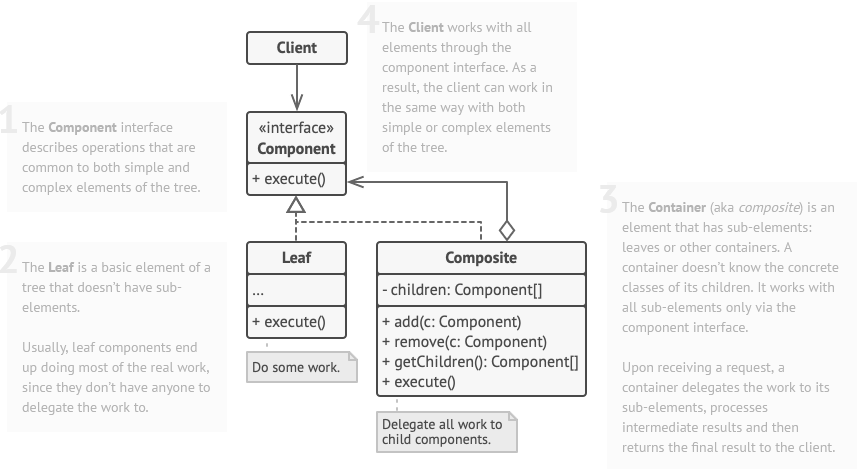

## [Composite Design Pattern](https://www.youtube.com/watch?v=oo9AsGqnisk)

[Complexere video](https://www.youtube.com/watch?v=EWDmWbJ4wRA)

### Probleem

### Voorbeeld

### Oplossing

1. Maak een interface voor de componenten
   - Deze interface bevat de methodes die de componenten moeten implementeren
2. Maak een Leaf klasse voor individuele componenten
   - Deze klasse implementeert de interface
3. Maak een Composite klasse voor groepen van componenten
   - Deze klasse implementeert de interface
   - Deze klasse bevat een lijst van componenten
   - Deze klasse bevat methodes om componenten toe te voegen en te verwijderen

### Voorbeeld Vervolg

> stappen komen overeen met de stappen in de algemene oplossing

# [TERUG NAAR INHOUDSOPGAVE](../README.md)
