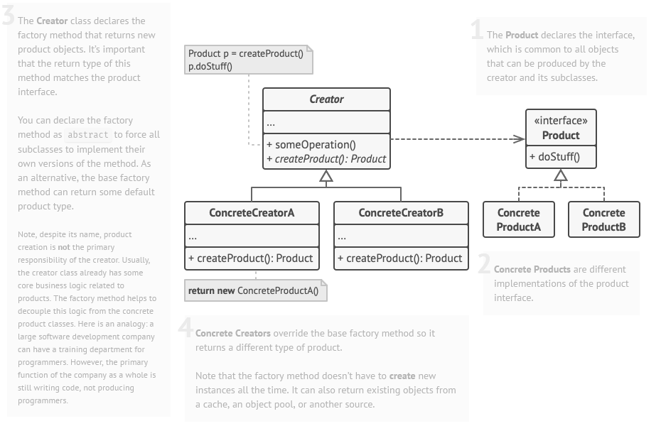

## [Factory Method Pattern](https://www.youtube.com/watch?v=EcFVTgRHJLM&list=PLrhzvIcii6GNjpARdnO4ueTUAVR9eMBpc&index=4)

### Probleem


### Voorbeeld


### Oplossing - Algemeen

1. Maak een factory interface, deze bevat een methode(s) die een object(en) van een bepaald type teruggeeft
2. Maak een concrete factory die de interface implementeert

> Creator = factory
   

### Voorbeeld Vervolg

> stappen komen overeen met de stappen in de algemene oplossing

1. ```java
   public interface FlyBehaviour {
       public String fly();
   }
   ```

# [TERUG NAAR INHOUDSOPGAVE](../README.md)
