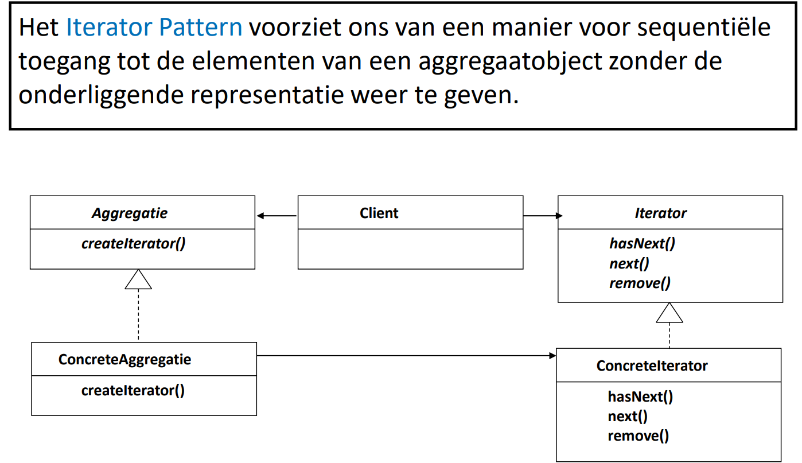
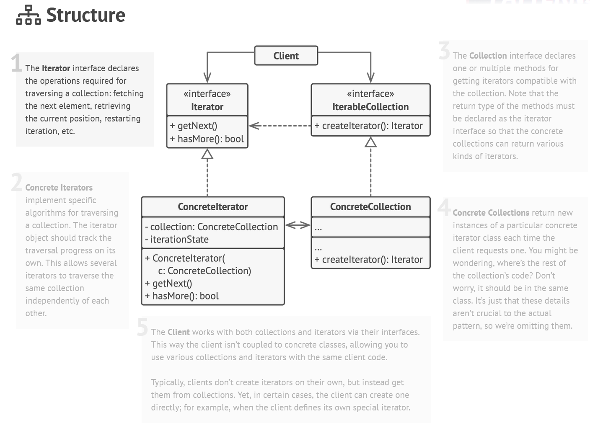

## [Iterator Design Pattern](https://www.youtube.com/watch?v=QCWJWfuAfJc)

[Simpele uitleg](https://www.youtube.com/watch?v=wqD4fOiGep4)

### Probleem

Het Iterator-patroon is een ontwerppatroon dat wordt gebruikt om een gestandaardiseerde manier te bieden om door een
verzameling van objecten te itereren zonder de details van de implementatie van die verzameling bloot te leggen.

Dit patroon is nuttig omdat het een scheiding mogelijk maakt tussen het itereren over een verzameling en de
implementatie van die verzameling, waardoor de verzameling gemakkelijker kan worden aangepast zonder dat de code die
deze gebruikt hoeft te worden gewijzigd.

Bovendien biedt het Iterator-patroon ook de mogelijkheid om complexe iteratiegedrag te ondersteunen, zoals achterwaartse
of onvolledige iteratie. Door een gemeenschappelijke iteratie-interface te bieden, kunnen verschillende soorten
verzamelingen eenvoudig worden geïntegreerd met verschillende soorten iteratiecode.

Kortom, het Iterator-patroon is een handig hulpmiddel voor het beheren van collecties van objecten en het biedt een
eenvoudige en flexibele manier om door deze objecten te itereren zonder de complexiteit van de implementatie bloot te
leggen.

### Voorbeeld

Stel je voor dat je een applicatie hebt die een lijst van objecten bevat, bijvoorbeeld een lijst van klanten. Om door
deze lijst te bladeren, kun je het Iterator-patroon gebruiken om een gemeenschappelijke iteratie-interface te bieden
voor verschillende soorten verzamelingen.

### Oplossing

1. Iterator Interface (Iterator)
    - hasNext() Geeft aan of er een volgend object is
    - next() Geeft het volgende object terug
    - remove() Verwijdert het huidige object
2. Concrete Iterator(s)
    - Implementeert de Iterator interface
    - Houdt een referentie naar de ConcreteAggregate
    - Houdt een interne positie in de lijst bij
3. Aggregate/Collectie Interface (Aggregate)
    - Maakt een Iterator aan
    - Geeft de Iterator terug
4. Concrete Aggregate/collectie (ConcreteAggregate)
    - Implementeert de Aggregate interface
    - Houdt een lijst bij van objecten
    - Maakt een ConcreteIterator aan
    - Geeft de ConcreteIterator terug

### Voorbeeld Vervolg

> stappen komen overeen met de stappen in de algemene oplossing

# [TERUG NAAR INHOUDSOPGAVE](../README.md)
