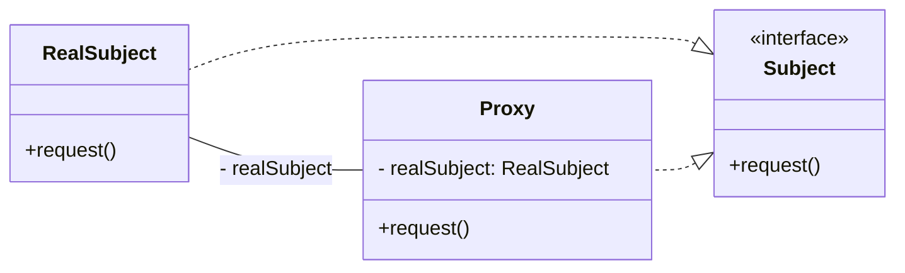

## [Proxy Design Pattern](https://www.youtube.com/watch?v=NwaabHqPHeM&t=1291s)

> NOTE ENKEL VIRTUEEL PROXY WORDT UITGELEGD

- Virtuele proxy:
    - Een virtuele proxy wordt gebruikt om de kosten van het maken van een object uit te stellen totdat het
      daadwerkelijk
      nodig is. Dit kan handig zijn bij het werken met objecten die veel systeembronnen vereisen of waarvan de
      constructie
      tijdrovend is. In plaats van het echte object direct te maken, maakt de virtuele proxy een placeholder-object dat
      als surrogaat fungeert. Het werkelijke object wordt pas gemaakt wanneer een client erom vraagt. Dit patroon kan
      ook
      worden gebruikt om extra functionaliteit toe te voegen aan het echte object, zoals lazy loading van gegevens.

- Beschermende proxy:
    - Een beschermende proxy wordt gebruikt om de toegang tot een object te controleren. Het controleert of de client
      geautoriseerd is om bepaalde operaties op het object uit te voeren voordat het de operatie doorstuurt naar het
      echte
      object. Dit patroon wordt vaak gebruikt in situaties waarin toegangscontrole en beveiliging een rol spelen, zoals
      het beperken van toegang tot bepaalde gevoelige gegevens of het afdwingen van machtigingen.

- Remote proxy:
    - Een remote proxy wordt gebruikt om de communicatie tussen een client en een object dat zich op een andere locatie
      bevindt te beheren. Het fungeert als een lokaal surrogaat voor het externe object en handelt de
      netwerkcommunicatie
      af, bijvoorbeeld door verzoeken door te sturen via het netwerk en de ontvangen resultaten terug te sturen naar de
      client. Dit patroon is vooral handig bij het werken met gedistribueerde systemen of bij het gebruik van services
      via
      een netwerk.

### Probleem

Deze proxy-patronen bieden een manier om de interactie tussen clients en objecten te beheren en extra functionaliteit
toe te voegen, zoals vertraging bij het maken van objecten, toegangscontrole of netwerkcommunicatie.

### Voorbeeld

Stel je voor dat je een afbeelding hebt die groot is en veel tijd kost om te laden. In plaats van de afbeelding
onmiddellijk te laden, kun je een virtuele proxy gebruiken. Het virtuele proxy-object fungeert als een surrogaat voor de
echte afbeelding.

Wanneer je de afbeelding in je programma wilt weergeven, maakt het virtuele proxy-object niet onmiddellijk de volledige
afbeelding. In plaats daarvan toont het een tijdelijke representatie, zoals een lege rechthoek of een laadicoon. Dit is
snel en vereist minder systeembronnen.

Op het moment dat je daadwerkelijk de afbeelding nodig hebt, bijvoorbeeld wanneer de gebruiker erop klikt om het in
volledige grootte te bekijken, zal het virtuele proxy-object de echte afbeelding maken en deze laden. Op deze manier
wordt de afbeelding pas geladen wanneer dat nodig is, waardoor je systeem efficiënter werkt en betere prestaties biedt.

Kortom, een virtuele proxy stelt de creatie of het laden van een zwaar object uit totdat het daadwerkelijk nodig is,
waardoor de prestaties worden verbeterd en systeembronnen worden bespaard.

### Oplossing



1. **Subject**: Dit is de interface of abstracte klasse die zowel de Proxy als de RealSubject implementeert. Het bevat
   de
   gemeenschappelijke methode request() die door zowel de Proxy als de RealSubject wordt gebruikt.
2. **RealSubject**: Dit is de concrete klasse die de werkelijke functionaliteit bevat die door de Proxy wordt
   uitgesteld.
   Het implementeert de request()-methode om de werkelijke bewerkingen uit te voeren.
3. **Proxy**: Dit is de klasse die fungeert als een surrogaat voor de RealSubject. Het implementeert ook de request()
   -methode, maar voegt extra logica toe voordat het de bewerking doorstuurt naar de RealSubject. Deze extra logica kan
   bijvoorbeeld het uitstellen van de werkelijke bewerking zijn totdat deze echt nodig is (virtual proxy).

### Voorbeeld Vervolg

1. ```java
   public interface Image {
       void display();
   }
   ```
2. ```java
   public class RealImage implements Image {
       private String fileName;
   
       public RealImage(String fileName) {
           this.fileName = fileName;
           loadFromDisk(fileName);
       }
   
       @Override
       public void display() {
           System.out.println("Displaying " + fileName);
       }
   
       private void loadFromDisk(String fileName) {
           System.out.println("Loading " + fileName);
       }
   }
   ```
3. ```java
    public class ProxyImage implements Image {
         private RealImage realImage;
         private String fileName;
    
         public ProxyImage(String fileName) {
              this.fileName = fileName;
         }
    
         @Override
         public void display() {
              if (realImage == null) {
                realImage = new RealImage(fileName);
              }
              realImage.display();
         }
    }
    ```
4. ```java
    public class ProxyPatternDemo {
         public static void main(String[] args) {
              Image image = new ProxyImage("test_10mb.jpg");
    
              // image will be loaded from disk
              image.display();
              System.out.println("");
    
              // image will not be loaded from disk (already loaded in cache)
              image.display();
         }
    }
    ```

# [TERUG NAAR INHOUDSOPGAVE](../README.md)
