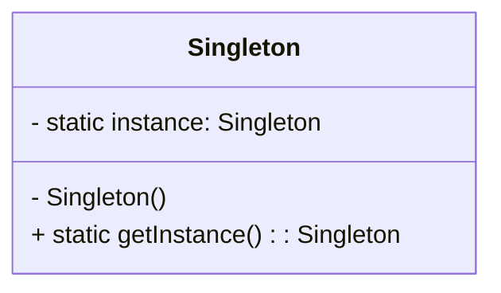

## [Singleton Pattern](https://www.youtube.com/watch?v=hUE_j6q0LTQ)

### Probleem

Je wil dat er maar 1 instantie van een klasse bestaat.

Er bestaan veel objecten waar we maar 1 instantie van
nodig hebben

- Thread pools, caches, objecten voor het loggen, objecten die
  fungeren als device drivers voor apparaten als printers en
  grafische kaarten,…
- Meer dan 1 instantie aanmaken van deze objecten garandeert
  problemen

Zorgt voor 1 globaal toegankelijk punt voor het object

### Typische voorbeelden

- Een klasse die een verbinding maakt met een database
- Calendar calendar = Calendar.getInstance();
    - “Gets a calendar using the default time zone and locale.”
- System.out
    - Het PrintStream object verbonden met de enige standaard
      outputstream van de applicatie
- System.in
    - Het InputStream object verbonden met de enige standaard
      inputstream van de applicatie

### Oplossing

1. Maak een klasse die singleton moet zijn
    - Maak de constructor private
    - Maak een private static variabele van het type van de klasse aan
    - Maak een static methode die de instantie teruggeeft



### Voorbeeld

> in het voorbeeld hieronder wordt de singleton direct geïnitialiseerd.
> Dit is zodat er bij multithreading geen problemen kunnen ontstaan.
> Dit kan ook opgelost worden door de getInstance methode te synchroniseren. (zie voorbeeld onder stap1)

1. ```java
   public class Singleton {
         private static Singleton instance = new Singleton();
   
        //mogelijk andere variables
   
         private Singleton() {
         }
   
         public static Singleton getInstance() {
              return instance;
         }
   
        //mogelijk andere methodes
   }
   ```

```java
public class Singleton {
      private static Singleton instance;

     //mogelijk andere variables

      private Singleton() {
      }

      public static synchronized Singleton getInstance() {
            if (instance == null) {
                  instance = new Singleton();
            }
            return instance;
      }

     //mogelijk andere methodes
}
```

# [TERUG NAAR INHOUDSOPGAVE](../README.md)

> Voorbeeld chocoladefabriek

```java
public class ChocolateBoiler {
    private boolean empty;
    private boolean boiled;
    private static ChocolateBoiler uniqueInstance;

    private ChocolateBoiler() {
        empty = true;
        boiled = false;
    }

    public static ChocolateBoiler getInstance() {
        if (uniqueInstance == null) {
            System.out.println("Creating unique instance of Chocolate Boiler");
            uniqueInstance = new ChocolateBoiler();
        }
        System.out.println("Returning instance of Chocolate Boiler");
        return uniqueInstance;
    }

    public void fill() {
        if (isEmpty()) {
            empty = false;
            boiled = false;
            // fill the boiler with a milk/chocolate mixture
        }
    }

    public void drain() {
        if (!isEmpty() && isBoiled()) {
            // drain the boiled milk and chocolate
            empty = true;
        }
    }

    public void boil() {
        if (!isEmpty() && !isBoiled()) {
            // bring the contents to a boil
            boiled = true;
        }
    }

    public boolean isEmpty() {
        return empty;
    }

    public boolean isBoiled() {
        return boiled;
    }
}
```

```java